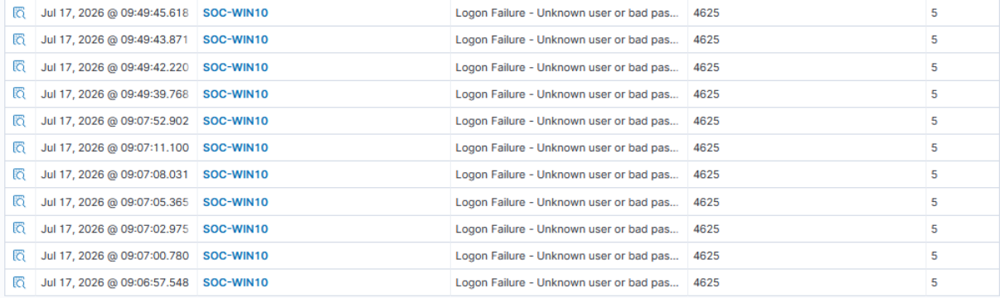

# SOC Homelab - Wazuh Detection Lab

## Overview

This project demonstrates a SOC homelab built using Wazuh and Sysmon for Windows security monitoring.

The objective is to detect Windows brute-force login attempts by creating a custom Wazuh detection rule.

---

## Lab Environment

- Windows 10
- Ubuntu Server
- Wazuh Manager
- Wazuh Dashboard
- Sysmon
- VirtualBox

---

## Attack Simulation

The following attack was simulated:

- Multiple failed Windows logon attempts (Event ID 4625)
- Custom Wazuh rule triggered after repeated failures
- High severity alert generated

---

## Detection Logic

The custom rule detects:

- Five failed logon events
- Within sixty seconds
- Generates a Level 12 alert

MITRE ATT&CK

- T1110 - Brute Force

---

## Screenshots

### Failed Logon Events



### Custom Detection Alert


---

## Repository Structure

```
images/
reports/
rules/
README.md
```

---

## Future Improvements

- PowerShell Detection
- Administrator Group Monitoring
- Account Creation Detection
- Scheduled Task Detection
- RDP Monitoring
- Sysmon Detection Engineering

---
