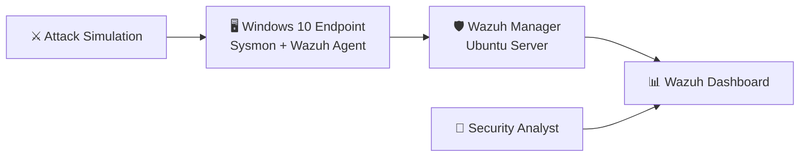

# 🛡️ SOC Homelab - Wazuh Detection Lab

Hands-on Detection Engineering & Security Monitoring using Wazuh, Sysmon, and Windows Event Logs.


## Overview

This repository documents my hands-on SOC Homelab, built to practice detection engineering, security monitoring, and incident investigation using Wazuh.

The goal is to simulate real-world attack techniques, analyze Windows security events, and improve blue team investigation skills.

---

## 🏗️ Lab Architecture



---

## 🖥️ Lab Environment

- Ubuntu Server
- Windows 10
- Wazuh Manager 4.12
- Wazuh Agent
- Sysmon
- VirtualBox

---

## 📊 Skills Demonstrated

- SIEM Monitoring (Wazuh)
- Windows Event Log Analysis
- Sysmon Telemetry Analysis
- Detection Engineering
- Incident Investigation
- MITRE ATT&CK Mapping
- Windows Security Monitoring

## 🔍 Detection Scenarios

##  Brute Force Detection

**Objective**

Detect multiple failed Windows logon attempts using Wazuh.

**Windows Event ID**

- 4625

**MITRE ATT&CK**

- T1110 – Brute Force

- ## Detection Alert


- ## Failed Logon Events


---

## 🚀 Upcoming Detection Labs

- [x] Brute Force Detection
- [ ] PowerShell → CMD Detection
- [ ] User Added to Administrators
- [ ] New Local User Detection
- [ ] Scheduled Task Detection
- [ ] Windows Service Creation
- [ ] RDP Monitoring

---

## 📂 Repository Structure

```text
SOC-Homelab-Wazuh-Detection-Lab
│
├── images/
├── reports/
├── rules/
└── README.md
```
---

## 🎯 Learning Goals

- Detection Engineering
- Windows Event Analysis
- SOC Investigation
- Threat Detection
- MITRE ATT&CK
- Wazuh
- Sysmon

---

⭐ This repository will continue to grow as I build new detection scenarios.
