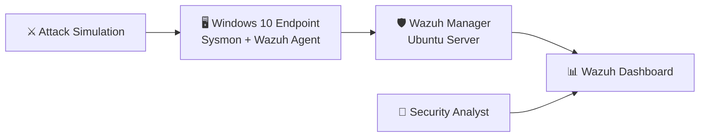

#  SOC Homelab - Wazuh Detection Lab

## Overview

This repository documents my hands-on SOC Homelab, built to practice detection engineering, security monitoring, and incident investigation using Wazuh.

The goal is to simulate real-world attack techniques, analyze Windows security events, and improve blue team investigation skills.

---

# Lab Architecture

## 🏗️ Lab Architecture



---

# Lab Environment

- Ubuntu Server
- Windows 10
- Wazuh Manager 4.12
- Wazuh Agent
- Sysmon
- VirtualBox

---

#  Detection Scenarios

##  Brute Force Detection

**Objective**

Detect multiple failed Windows logon attempts using Wazuh.

**Windows Event ID**

- 4625

**MITRE ATT&CK**

- T1110 – Brute Force

- ## Detection Alert


- ## Failed Logon Events


---

## Upcoming Detection Labs

- PowerShell spawning CMD
- User added to Administrators
- New Local User Created
- Scheduled Task Creation
- Windows Service Creation
- RDP Logon Detection

---

#  Repository Structure

```
images/
reports/
rules/
README.md
```

---

#  Learning Goals

- Detection Engineering
- Windows Event Analysis
- SOC Investigation
- Threat Detection
- MITRE ATT&CK
- Wazuh
- Sysmon

---

⭐ This repository will continue to grow as I build new detection scenarios.
